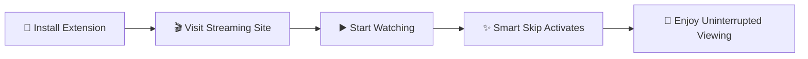

<div align="center">
  
# 🎬 Smart Skip
### *The Ultimate Streaming Companion*

**✨ Automatically skip intros, recaps, credits, ads, and seamlessly navigate to next episodes ✨**

<br>

[](https://addons.mozilla.org/firefox/)
[](https://github.com/Nick190401/Smart-Skip)
[](LICENSE)
[](manifest.json)

<br>


*Binge-watch without interruptions across 25+ streaming platforms*

</div>

---

<div align="center">

## ✨ **Why Smart Skip?**

*Transform your streaming experience with intelligent automation*

</div>

## 🚀 **Features That Matter**

<table>
<tr>
<td width="50%">

### 🎯 **Intelligent Auto-Skip**
> *Say goodbye to repetitive clicking*

- 🎭 **Skip Intro** → Auto-clicks "Skip Intro" buttons
- 📺 **Skip Recap** → Bypasses "Previously on..." segments  
- 🎬 **Skip Credits** → Fast-forward through end credits
- 📢 **Skip Ads** → Removes advertisement interruptions
- ⏭️ **Auto Next Episode** → Seamless episode transitions

</td>
<td width="50%">

### 🧠 **Smart Series Detection**
> *Knows what you're watching, when you're watching it*

- 🎥 **Real-time Detection** → Instantly recognizes current series
- ⚙️ **Series-Specific Settings** → Granular control per show
- 🔄 **Dynamic Adaptation** → Responds to content changes
- 🌍 **Multi-language Support** → Works in 12+ languages

</td>
</tr>
</table>

### ⚙️ **Flexible Configuration**

<details>
<summary><strong>🌐 Global Settings</strong> - Apply preferences across all platforms</summary>

- Master enable/disable switch
- Universal skip preferences
- Performance optimization controls
</details>

<details>
<summary><strong>🎯 Domain-Specific Settings</strong> - Different rules for each streaming service</summary>

- Platform-specific behavior
- Service-optimized detection
- Custom timing adjustments
</details>

<details>
<summary><strong>📺 Series-Specific Settings</strong> - Custom behavior for individual shows</summary>

- Per-show skip preferences
- Episode-specific controls
- Advanced timing options
</details>

<details>
<summary><strong>🗣️ Language Selection</strong> - Interface adapts to your preference</summary>

- Auto-detection from browser
- Manual override capability
- 12+ supported languages
</details>

### 🌐 **Extensive Platform Support**

<div align="center">

*Supporting your favorite streaming platforms worldwide*

</div>

| **🏆 Premium Platforms** | **🎌 Anime & International** | **🇩🇪 German Platforms** | **🎥 Additional Platforms** |
|:-------------------------|:------------------------------|:---------------------------|:-----------------------------|
| 🔴 **Netflix** (all regions) | 🍥 **Crunchyroll** | 📺 **Sky** | 🎮 **Twitch** |
| 🏰 **Disney+** | 🎭 **Funimation** | 📻 **Joyn** | 📹 **Vimeo** |
| 📦 **Amazon Prime** (global) | 🌸 **Wakanim** | 📡 **RTL+** | 🎞️ **Dailymotion** |
| 🍎 **Apple TV+** | | 📺 **ProSieben** | |
| 📺 **HBO Max / Max** | | 🏛️ **ZDF** | |
| 🌊 **Hulu** | | 🏛️ **ARD** | |
| ⛰️ **Paramount+** | | 📚 **Mediathek** | |
| 🦚 **Peacock** | | | |
| ▶️ **YouTube** | | | |

<div align="center">

**✨ 25+ platforms and counting! ✨**

*Each platform optimized with custom detection algorithms*

</div>

---

<div align="center">

## 🚀 **Quick Installation**

*Get up and running in under 2 minutes*

</div>

### 🌟 **Recommended Installation**

<table>
<tr>
<td width="60%">

#### 🦊 **Firefox Add-ons Store**
> *Coming soon to the official store*

The easiest way to install Smart Skip with automatic updates and full security verification.

**Status:** 🔄 *Pending Mozilla Review*

</td>
<td width="40%">

```bash
# Coming Soon
Firefox Add-ons Store
✅ Automatic Updates
✅ Security Verified
✅ One-Click Install
```

</td>
</tr>
</table>

### 🛠️ **Manual Installation**

<details>
<summary><strong>📋 Step-by-Step Guide</strong></summary>

1. **📥 Download** the latest release from [GitHub Releases](https://github.com/Nick190401/Smart-Skip/releases)
2. **🦊 Open Firefox** and navigate to `about:addons`
3. **⚙️ Click the gear icon** and select "Install Add-on From File"
4. **📁 Select** the downloaded `.xpi` file
5. **✅ Click "Add"** to confirm installation
6. **🔐 Grant permissions** when prompted

</details>

### 👨‍💻 **Development Installation**

<details>
<summary><strong>🔧 For Developers & Beta Testers</strong></summary>

```bash
# Clone the repository
git clone https://github.com/Nick190401/Smart-Skip.git
cd Smart-Skip

# Load in Firefox
# 1. Navigate to about:debugging
# 2. Click "This Firefox"
# 3. Click "Load Temporary Add-on"
# 4. Select manifest.json
```

</details>

### 🌐 **Chrome/Chromium Support**

<details>
<summary><strong>🧪 Experimental Support</strong></summary>

> ⚠️ **Note:** Optimized for Firefox, but may work in Chrome

```bash
# Chrome Installation
# 1. Download source code
# 2. Navigate to chrome://extensions/
# 3. Enable "Developer mode"
# 4. Click "Load unpacked"
# 5. Select project directory
```

</details>

---

<div align="center">

## 🎮 **How to Use**

*Master your streaming experience in 3 simple steps*

</div>

### ⚡ **Quick Start Guide**



<table>
<tr>
<td width="25%">

#### 1️⃣ **Install**
> Install using any method above

🎯 *One-time setup*

</td>
<td width="25%">

#### 2️⃣ **Visit**
> Go to any supported platform

🌐 *Netflix, Disney+, etc.*

</td>
<td width="25%">

#### 3️⃣ **Watch**
> Smart Skip auto-detects series

🧠 *Intelligent recognition*

</td>
<td width="25%">

#### 4️⃣ **Configure**
> Click extension icon for settings

⚙️ *Personalize experience*

</td>
</tr>
</table>

### 🎛️ **Configuration Dashboard**

<details>
<summary><strong>🌍 Global Settings</strong></summary>

- **🔘 Master Toggle** - Enable/disable extension globally
- **🔍 Debug Mode** - Verbose logging for troubleshooting
- **⚡ Performance** - Optimize for your system

</details>

<details>
<summary><strong>📺 Series-Specific Controls</strong></summary>

- **🎭 Skip Intro** → Auto-click "Skip Intro" buttons
- **📰 Skip Recap** → Auto-click recap skip options  
- **🎬 Skip Credits** → Auto-click credit skip buttons
- **📢 Skip Ads** → Auto-click advertisement skip buttons
- **⏭️ Auto Next** → Automatically advance to next episodes

</details>

<details>
<summary><strong>🌐 Platform Controls</strong></summary>

- **🔧 Per-Site Toggle** → Enable/disable for specific websites
- **🎯 Override Global** → Site-specific preferences
- **📊 Platform Stats** → Usage analytics per service

</details>

### 🗣️ **Multi-Language Support**

<div align="center">

**🌍 Comprehensive International Support**

| 🇺🇸 English | 🇩🇪 Deutsch | 🇫🇷 Français | 🇪🇸 Español |
|:-------------|:-------------|:-------------|:-------------|
| 🇮🇹 Italiano | 🇵🇹 Português | 🇳🇱 Nederlands | 🇵🇱 Polski |
| 🇷🇺 Русский | 🇯🇵 日本語 | 🇰🇷 한국어 | 🇨🇳 中文 |

*Automatically detects and clicks skip buttons in 12 languages*

**New in v1.2.0:** Enhanced pattern recognition for international streaming platforms

</div>

---

<div align="center">

## 🛠️ **Technical Excellence**

*Built with modern standards and cutting-edge technology*

</div>

### 🧠 **Intelligent Detection System**

<table>
<tr>
<td width="50%">

#### ⚡ **Real-Time Processing**
- **🔄 Event-Driven** → Responds to navigation & video events instantly
- **🎯 Adaptive Polling** → Smart frequency adjustment for optimal performance
- **🏗️ Platform-Specific** → Tailored algorithms for each streaming service
- **🛡️ Error Handling** → Graceful fallbacks and comprehensive recovery

</td>
<td width="50%">

#### 🌍 **Advanced Recognition**
- **🗣️ Multi-Language** → Button detection in 12 languages (English, German, Spanish, French, Portuguese, Italian, Dutch, Polish, Russian, Japanese, Korean, Chinese)
- **⏱️ Smart Cooldown** → Prevents rapid-fire clicking and spam
- **🎮 Universal Patterns** → Language-independent button matching with regex
- **📱 Responsive Design** → Adapts to different screen sizes

</td>
</tr>
</table>

### 🎬 **Netflix Mastery**

<details>
<summary><strong>🔬 Advanced Netflix Integration</strong></summary>

- **📄 Page Recognition** → Distinguishes watch/title/browse pages intelligently
- **🔄 SPA Handling** → Adapts to Netflix's complex Single Page Application
- **📺 Content Separation** → Accurately separates series from episode info
- **🌐 Global Support** → Works across all Netflix regions and languages
- **📊 Progress Tracking** → Detects episode changes and series navigation
- **🔗 Playback Integration** → Seamless with autoplay and continue watching

</details>

### 🔧 **Cross-Platform Architecture**

<div align="center">

```
🏗️ Manifest V3 Foundation
    ↓
🔧 Unified Content Scripts
    ↓
🎯 Domain-Specific Optimization
    ↓
🌐 Universal Button Detection
    ↓
📱 Responsive Interface
```

</div>

### 💾 **Robust Storage & Sync**

| **Feature** | **Description** | **Benefit** |
|:------------|:----------------|:------------|
| 🔄 **Firefox Sync** | Cross-device synchronization | Settings follow you everywhere |
| 💾 **Local Fallback** | Reliable local storage | Works even offline |
| 🛡️ **Multi-Layer** | sync → local → localStorage → memory | Maximum reliability |
| ⚡ **Real-Time** | Instant settings application | Immediate response |
| 🔍 **Data Integrity** | Automatic validation & recovery | Corruption-proof |

---

<div align="center">

## 🏗️ **Architecture & Design**

*Clean, modular, and maintainable codebase*

</div>

### 📁 **Project Structure**

```
🎬 Smart Skip/
├── 📋 manifest.json              # Extension configuration & permissions
├── 🎯 src/
│   ├── 🧠 content/
│   │   └── ⚙️ skipper.js        # Core skip logic & detection algorithms
│   ├── 🎨 popup/
│   │   ├── 🖼️ popup.html        # Beautiful popup interface
│   │   └── ⚡ popup.js          # Settings management & UI logic
│   ├── 🔄 background/
│   │   └── 🌐 background.js     # Service worker & messaging
│   └── 🗣️ shared/
│       └── 🌍 language.js       # Multi-language support system
├── 🎨 assets/
│   └── 🎭 icons/
│       └── 🎬 icon.svg          # Beautiful extension icon
└── 📖 README.md                 # This documentation
```

### 🧩 **Core Components**

<table>
<tr>
<td width="50%">

#### 🎯 **Content Script** (`skipper.js`)
> *The brain of the operation*

- 🧠 **Series Detection** → Advanced extraction algorithms
- 🔍 **Button Scanning** → Intelligent pattern matching
- 🗣️ **Multi-Language** → Universal text recognition
- ⚡ **Event-Driven** → Optimized performance system
- 🎯 **Platform-Specific** → Tailored extraction methods

#### 🌐 **Background Worker** (`background.js`)
> *Behind-the-scenes coordination*

- 🔄 **Settings Sync** → Cross-device synchronization
- 📡 **Messaging** → Inter-component communication
- 🔧 **Lifecycle** → Extension state management
- 💾 **Storage** → Optimization and caching

</td>
<td width="50%">

#### 🎨 **Popup Interface** (`popup.html` + `popup.js`)
> *Beautiful and intuitive control center*

- ⚙️ **Settings Management** → Intuitive configuration
- 📊 **Real-Time Display** → Live series detection
- 🗣️ **Language Selection** → Multi-language interface
- 🎛️ **Platform Toggles** → Granular control options

#### 🌍 **Language System** (`language.js`)
> *Global accessibility and localization*

- 🔍 **Auto-Detection** → Browser language recognition
- 🔧 **Manual Override** → User preference control
- 📚 **Translation Support** → Comprehensive coverage
- 🔄 **Dynamic Updates** → Real-time interface changes

</td>
</tr>
</table>

---

<div align="center">

## 🆘 **Troubleshooting Guide**

*Quick solutions to common issues*

</div>

### 🚨 **Common Issues & Solutions**

<table>
<tr>
<td width="30%">

#### 🔧 **Extension Not Working**
> *First steps to diagnose*

</td>
<td width="70%">

✅ **Check platform support** → See supported platforms list above  
✅ **Verify settings** → Open popup, ensure "Enable for this website" is checked  
✅ **Check permissions** → Extension needs permissions for current site  
✅ **Refresh page** → Sometimes helps with detection  
✅ **Browser compatibility** → Currently optimized for Firefox (Manifest V3)  
✅ **Clear cache** → Old cached data might interfere  

</td>
</tr>
<tr>
<td width="30%">

#### 📺 **Series Not Detected**
> *Content recognition issues*

</td>
<td width="70%">

⏱️ **Wait a moment** → Detection can take a few seconds on complex pages  
🎬 **Navigate to video page** → Ensure you're on content page, not browsing  
▶️ **Check video elements** → Some platforms need active video player  
🎭 **Try different content** → Some shows have non-standard page structures  
🔍 **Enable verbose logging** → See detailed detection information  

</td>
</tr>
<tr>
<td width="30%">

#### 💾 **Settings Not Saving**
> *Storage and sync problems*

</td>
<td width="70%">

🔐 **Check permissions** → Ensure extension has storage permissions  
🔄 **Verify Firefox Sync** → Check if account sync is working  
💾 **Try local storage** → Extension auto-falls back if sync fails  
🔄 **Disable/re-enable** → Sometimes helps reset storage system  
💽 **Check disk space** → Ensure sufficient storage available  

</td>
</tr>
<tr>
<td width="30%">

#### 🖱️ **Buttons Not Clicking**
> *Skip functionality issues*

</td>
<td width="70%">

⚙️ **Check series settings** → Verify skip options enabled for current series  
⏰ **Check timing** → Some buttons only appear at specific playback times  
👁️ **Check visibility** → Extension only clicks visible, clickable buttons  
🔧 **Platform changes** → Services might have updated button structures  
⏱️ **Cooldown period** → 1-second cooldown prevents spam clicking  

</td>
</tr>
</table>

### 🔍 **Advanced Debugging**

<details>
<summary><strong>🛠️ Enable Debug Mode</strong></summary>

1. 🎛️ **Open extension popup**
2. ✅ **Enable "Verbose Logging"**  
3. 🛠️ **Open browser developer tools** (F12)
4. 📝 **Check Console tab** for detailed logs
5. 🔄 **Refresh page** to see initialization logs

**Debug Information Includes:**
- 🎯 Series detection attempts and results
- 🔍 Button scanning and matching results  
- ⚙️ Setting changes and storage operations
- 🎯 Platform-specific logic execution
- ⏰ Event triggers and timing information
- 🚨 Error states and recovery attempts

</details>

<details>
<summary><strong>📊 Performance Monitoring</strong></summary>

**Monitor Extension Performance:**
- 🧠 Memory usage in task manager
- ⚡ Page load time impact
- 🔄 CPU usage during detection
- 📡 Network requests (should be none)
- 💾 Storage usage growth

**Optimization Tips:**
- 🎯 Disable on unused platforms
- ⏱️ Adjust polling frequency
- 🧹 Clear old series data
- 🔄 Restart browser periodically

</details>

---

<div align="center">

## 🤝 **Join the Community**

*Help us make Smart Skip even better*

</div>

### 🚀 **Contributing Made Easy**

<table>
<tr>
<td width="50%">

#### 👨‍💻 **For Developers**
> *Code contributions welcome*

```bash
# Quick start for contributors
git clone https://github.com/Nick190401/Smart-Skip.git
cd Smart-Skip
# Load in Firefox developer mode
# Start coding!
```

**Development Workflow:**
1. 🍴 Fork the repository
2. 🔧 Clone your fork locally  
3. 🛠️ Load extension in Firefox developer mode
4. ✨ Make your awesome changes
5. 🧪 Test across multiple platforms
6. 📋 Submit a pull request

</td>
<td width="50%">

#### 🎯 **For Everyone**
> *Non-coding contributions valued*

- 🐛 **Bug Reports** → Help us find issues
- 💡 **Feature Requests** → Share your ideas
- 🌍 **Translations** → Add your language
- 📖 **Documentation** → Improve guides
- 🧪 **Testing** → Try new features
- 📢 **Spread the Word** → Tell friends!

</td>
</tr>
</table>

### 🎨 **Contribution Areas**

<div align="center">

| **🌐 Platform Support** | **🗣️ Localization** | **🐛 Quality Assurance** | **📚 Documentation** |
|:------------------------|:---------------------|:-------------------------|:----------------------|
| Disney+ Hotstar | Arabic (العربية) | Cross-browser testing | Setup guides |
| Stan Australia | Hindi (हिंदी) | Performance testing | API documentation |
| Crave Canada | Thai (ไทย) | Accessibility testing | Video tutorials |
| More platforms... | More languages... | Edge case testing | User guides |

</div>

### 📋 **Contribution Guidelines**

<details>
<summary><strong>✅ Code Quality Standards</strong></summary>

- **🎯 Follow existing patterns** → Consistent code style
- **🧪 Test thoroughly** → Multiple platforms and browsers  
- **📝 Document changes** → Update README and comments
- **🔄 Ensure compatibility** → All supported platforms
- **⚡ Optimize performance** → Minimal resource usage
- **🛡️ Handle errors gracefully** → Robust error recovery

</details>

<details>
<summary><strong>🔍 Testing Checklist</strong></summary>

**Before submitting:**
- ✅ Test on Netflix (multiple regions)
- ✅ Test on Disney+ and Prime Video
- ✅ Verify series detection accuracy
- ✅ Check button clicking functionality
- ✅ Test settings persistence
- ✅ Verify multi-language support
- ✅ Check error handling
- ✅ Performance impact assessment

</details>

---

## 📄 License

This project is licensed under a custom License - see the [LICENSE](LICENSE) file for details.

---

## 🙏 Acknowledgments

- **Streaming Platforms** - For providing the entertainment we love to watch
- **Firefox Community** - For excellent extension development tools and documentation
- **Open Source Contributors** - For inspiration and code patterns
- **Beta Testers** - For helping identify and fix issues across different platforms

---

<div align="center">

## 📞 **Support & Community**

*We're here to help and connect*

</div>

### 🆘 **Get Help**

<table>
<tr>
<td width="33%">

#### 🐛 **Report Issues**
> *Found a bug? Let us know!*

[](https://github.com/Nick190401/Smart-Skip/issues)

**Report:**
- 🐛 Bugs and glitches
- ❌ Platform incompatibilities  
- 💔 Broken functionality
- 🔐 Security vulnerabilities

</td>
<td width="33%">

#### 💡 **Share Ideas**
> *Have a feature request?*

[](https://github.com/Nick190401/Smart-Skip/discussions)

**Discuss:**
- ✨ New feature ideas
- 🎯 Platform requests
- 🤔 General questions
- 💭 Improvement suggestions

</td>
<td width="33%">

#### 📚 **Documentation**
> *Detailed guides and info*

[](https://github.com/Nick190401/Smart-Skip/wiki)

**Find:**
- 📖 Setup guides
- 🔧 Configuration help
- 🛠️ Developer docs
- 🚀 Advanced features

</td>
</tr>
</table>

### ❓ **Frequently Asked Questions**

<details>
<summary><strong>🌍 Does this work with all Netflix regions?</strong></summary>

**✅ Yes!** Smart Skip is designed to work with Netflix in all regions and languages. Our advanced detection algorithms adapt to different Netflix interfaces worldwide.

</details>

<details>
<summary><strong>⚡ Will this slow down my browsing?</strong></summary>

**❌ No!** The extension uses efficient detection algorithms and only activates on supported streaming platforms. It has minimal impact on browser performance.

</details>

<details>
<summary><strong>🎛️ Can I disable it for specific shows?</strong></summary>

**✅ Absolutely!** You can configure series-specific settings through the popup interface. Each show can have individual skip preferences.

</details>

<details>
<summary><strong>🔒 Does this collect personal data?</strong></summary>

**❌ Never!** Smart Skip only stores your preferences locally and doesn't collect, transmit, or access any personal data. Your privacy is paramount.

</details>

<details>
<summary><strong>📺 Why doesn't it work on [Platform X]?</strong></summary>

**🔄 We're expanding!** We continuously add support for new platforms. Check our GitHub issues to request new platform support or contribute to development.

</details>

<details>
<summary><strong>🔧 How do I troubleshoot issues?</strong></summary>

**🛠️ Multiple solutions:**
1. Check our troubleshooting guide above
2. Enable verbose logging in the popup
3. Check browser developer console
4. Report issues on GitHub with logs

</details>

---

<div align="center">

## 📋 **Version History**

*Track our progress and improvements*

</div>

### 🚀 **Latest Release**

<table>
<tr>
<td width="20%">

#### 🏷️ **v1.1.8**
> *Current Version*

🗓️ **Released:** November 2025  
🎯 **Focus:** Prime Video Compatibility Fix

</td>
<td width="80%">

**✨ What's New:**
- 🟦 **Prime Video Fix** → Adjusted `getPlayerContainer()` fallback to ensure
  “Vorspann überspringen” / “Skip Intro” button is detected and clicked reliably  
- 🔍 Improved detection accuracy for Prime Video overlays  
- 🛠 Minor robustness tweaks in button scanning logic  

</td>
</tr>
</table>

### 📈 **Development Timeline**

<details open>
<summary><strong>🎉 Version 1.2.0 - International Edition (Current)</strong></summary>

**🌍 Major Features:**
- 🗣️ **Enhanced Multi-Language Support** → Comprehensive button detection in 12 languages:
  - English, German, Spanish, French, Portuguese, Italian
  - Dutch, Polish, Russian, Japanese, Korean, Chinese
- 🔍 **Improved Pattern Recognition** → Advanced regex patterns for international platforms
- 🐛 **Bug Fixes:**
  - Fixed Crunchyroll series detection in iframe contexts
  - Enhanced Amazon Prime Video episode extraction and skip button detection
  - Improved Netflix AutoNext timing (only clicks post-play, not control bar)
  - Better opacity threshold detection for invisible buttons
- 📝 **Code Quality** → Complete code documentation overhaul (English developer comments)
- 🎯 **Global Compatibility** → Works seamlessly across all language settings on supported platforms

**🔧 Technical Improvements:**
- Multi-language text pattern matching in button classification functions
- Enhanced safety checks to avoid clicking navigation elements
- Improved iframe isolation for better performance

</details>

<details>
<summary><strong>🎯 Version 1.1.5 - Multi-Language Expansion</strong></summary>

**🌍 Major Features:**
- 🗣️ **Multi-language Support** → Added support for 12+ languages
- 📺 **Platform Expansion** → Added Twitch, Vimeo, and Dailymotion support  
- ⚙️ **Settings Improvements** → Enhanced popup interface and settings management
- 🎨 **UI Overhaul** → More intuitive and responsive design

</details>

<details>
<summary><strong>⚡ Version 1.1.0 - The Great Rewrite</strong></summary>

**🔄 Complete Redesign:**
- 🧠 **Major Rewrite** → Complete redesign of detection algorithms
- 🔄 **Cross-Device Sync** → Added Firefox Sync support for settings
- 🎬 **Enhanced Netflix Support** → Improved series and episode detection
- 🛡️ **Error Handling** → Comprehensive error recovery system
- 📊 **Performance Monitoring** → Built-in performance optimization

</details>

<details>
<summary><strong>🎉 Version 1.0.0 - Initial Release</strong></summary>

**🚀 Foundation:**
- 🎯 **Initial Release** → Basic skip functionality for major platforms
- ⚙️ **Core Features** → Skip intro, recap, credits, and ads
- 📺 **Platform Support** → Netflix, Disney+, Prime Video, YouTube
- 🎨 **Simple Interface** → Basic popup with essential controls

</details>

### 🔮 **Coming Soon**

<div align="center">

| **🚀 Planned Features** | **📅 Timeline** | **💫 Status** |
|:------------------------|:---------------|:-------------|
| 🏪 Firefox Add-ons Store | Q4 2025 | 🔄 In Review |
| 🌐 Chrome Extension | Q1 2026 | 📋 Planned |
| 📱 Mobile Browser Support | Q2 2026 | 💭 Research |
| 🤖 AI-Powered Detection | Q3 2026 | 🔬 Experimental |

*Timeline subject to change based on Mozilla review process*

</div>

---

<div align="center">

## 📄 **License & Legal**

*Transparent and fair licensing*

</div>

<table>
<tr>
<td width="50%">

#### 📜 **License Information**
> *Custom license with clear terms*

[](LICENSE)

This project is licensed under a **Custom License**. See the [LICENSE](LICENSE) file for complete details and terms.

**Key Points:**
- ✅ Free for personal use
- ✅ Open source development
- ✅ Community contributions welcome
- ⚖️ Specific terms apply

</td>
<td width="50%">

#### 🔒 **Privacy & Security**
> *Your privacy matters to us*

[](https://github.com/Nick190401/Smart-Skip/security)

**Privacy Commitment:**
- 🚫 **No data collection** → Zero personal information gathered
- 🔒 **Local storage only** → Settings stay on your device
- 🛡️ **No external requests** → Extension works offline
- 🔐 **Minimal permissions** → Only what's absolutely necessary

</td>
</tr>
</table>

---

<div align="center">

## 🙏 **Acknowledgments**

*Standing on the shoulders of giants*

</div>

<table>
<tr>
<td width="25%">

#### 🎬 **Streaming Platforms**
> *Content creators*

Thank you for providing the entertainment we love to watch, and for building platforms that bring stories to life.

</td>
<td width="25%">

#### 🦊 **Firefox Community**
> *Development ecosystem*

Excellent extension development tools, comprehensive documentation, and a supportive developer community.

</td>
<td width="25%">

#### 🌟 **Open Source**
> *Inspiration & patterns*

The broader open source community for inspiration, code patterns, and best practices that make this project possible.

</td>
<td width="25%">

#### 🧪 **Beta Testers**
> *Quality assurance*

Our amazing beta testers who help identify and fix issues across different platforms and use cases.

</td>
</tr>
</table>

---

<div align="center">

## 🎉 **Ready to Skip?**

*Transform your streaming experience today*

<br>

[](https://github.com/Nick190401/Smart-Skip/releases)
[](https://github.com/Nick190401/Smart-Skip)
[](https://github.com/Nick190401/Smart-Skip/discussions)

<br>

### 🍿 **Enjoy uninterrupted streaming!** 

*Made with ❤️ for binge-watchers everywhere*

<br>


**🚀 Start your journey to seamless streaming today! 🚀**

</div>
